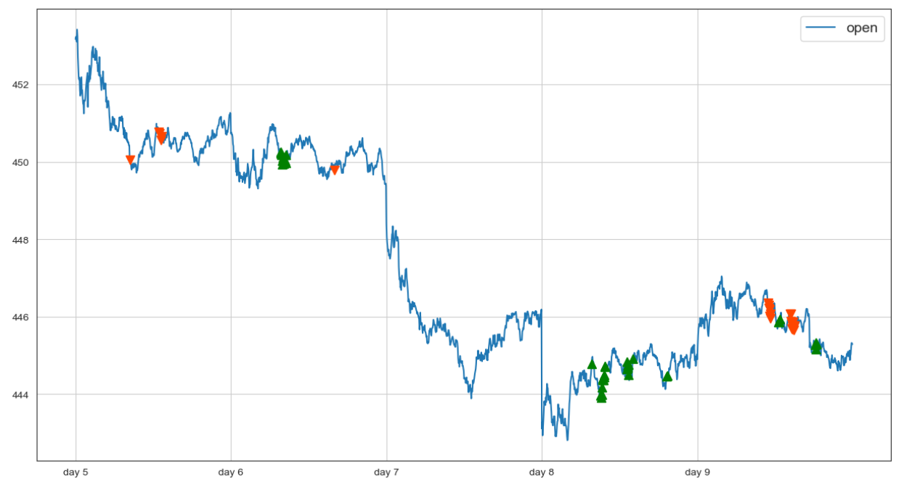

# LSTM_CNN_Regression_Classification_on_SPY

## Introduction

This project aims to predict the short-term high, low, and exact prices/rate changes/classifications of the SPY ETF using LSTM/CNN/WaveNet neural network models and ensemble learning. 

##  Data

The project utilizes about three months of historical price data and many other features (e.g. technical indicators) as input for the models. The raw data is from Alpha Vantage. More precisely speaking, the inputs are the 2-hour windows of those values. For the CNN model, the inputs are presented as the corresponding graphs. The outputs can be chosen from the high, low, or exact values/percentage changes/classifications in an hour in the future. For example, the high value means the maximum of the SPY prices during the future hour, while the exact value means the exact SPY price one hour later. 

## Models

Several models were implemented and tested in this project:

- LSTM Regression Model: A deep learning regression model with MAE about $0.4-0.5 for high/low values.  
- LSTMCNN Regression Model: We combine LSTM and CNN in three different ways with MAE above $0.6. The performances of these regression models may be improved by building a more complex structure and choosing better parameters.  
- WaveNet Regression Model: A deep learning model built from 1d CNN networks with MAE about $0.4-0.5 for high/low values. 
- Linear Regression Model: A linear regression model with MAE about $0.4-0.5 for high/low values.
- Ensemble Model: An ensemble stacking model based on the LSTM/WaveNet/Linear models above via SVR in the end, with MAE around $0.4 for high/low values. 
- CNN Classification model: The inputs are graphs containing information on prices, MACD, and Signal.  A classification model with 5 labels ('hcl' column in Targets) when predicting high values. Accuracy rate: about 25%. 
- CNNLSTM Classification Model: We put LSTM and CNN in three different ways. Classification models with 5 labels ('hcl' column in Targets) when predicting high values. Accuracy rate: about 30%. 

## Strategies

One can construct many strategies based on technical indicators and predictive models. We present two of them.

One is based on the features we constructed.

The other one utilizes our linear prediction models.

## Files

- The names of the notebooks indicate the models being used. "Update.ipynb" updates and preprocesses data on prices and technical indicators from Alpha Vantage. "linear.sav", "lstm.pt", and "wavenet.pt" are saved models/model parameters predicting high values, which are used in "Ensemble Stacking.ipynb". "linear_low.sav" is a saved linear model predicting low values, which is used together with "linear.sav" in "Strategy 2.ipynb". The folder "data" contains CSV files and image files.
